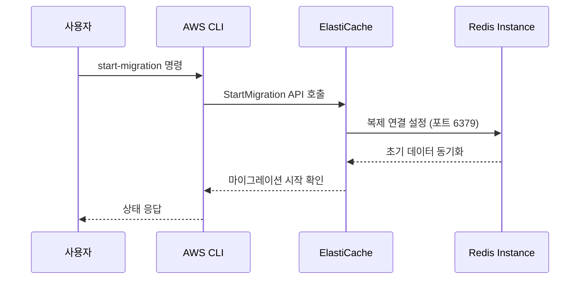
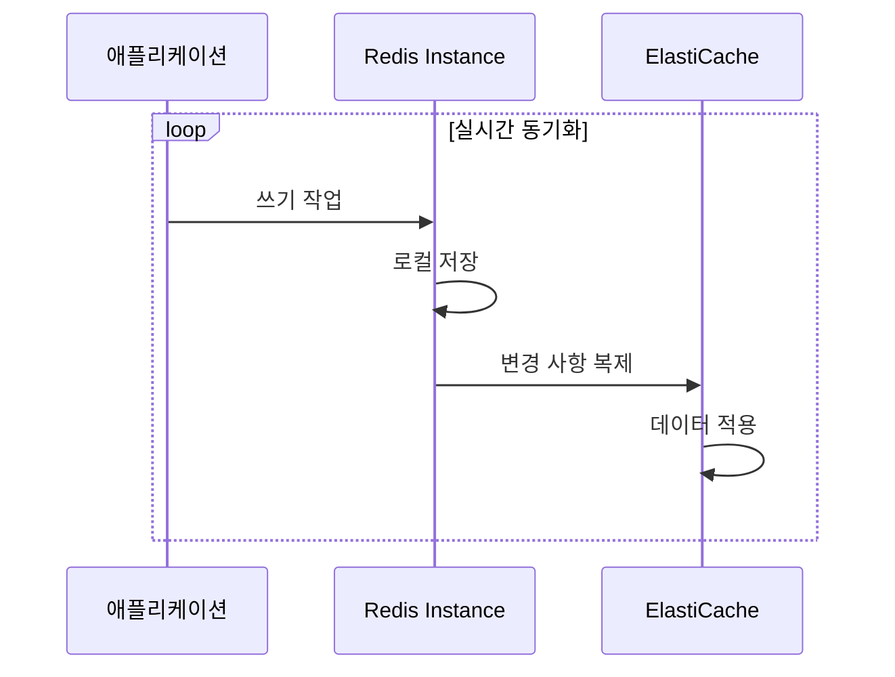
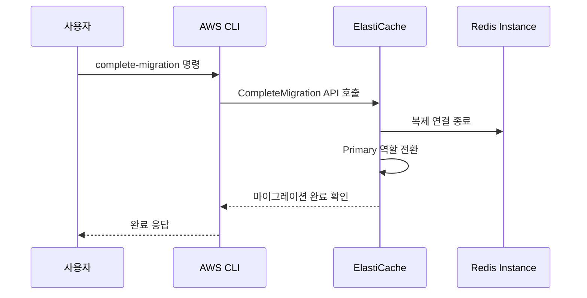

# 아키텍처

## 시스템 개요

Redis to ElastiCache Valkey 온라인 마이그레이션 테스트 환경은 AWS 클라우드에서 실제 마이그레이션 시나리오를 시뮬레이션할 수 있도록 설계된 완전한 인프라입니다. 이 환경은 프로덕션 환경의 마이그레이션을 안전하게 테스트하고 검증할 수 있는 모든 구성 요소를 포함합니다.

## 아키텍처 다이어그램

```
┌─────────────────────────────────────────────────────────────────────────────────┐
│                              AWS 리전 (예: us-east-1)                            │
├─────────────────────────────────────────────────────────────────────────────────┤
│                                                                                 │
│  ┌─────────────────────────────────────────────────────────────────────────┐    │
│  │                        VPC (10.0.0.0/16)                               │    │
│  │                                                                         │    │
│  │  ┌─────────────────────────┬─────────────────────────────────────────┐  │    │
│  │  │    가용 영역 A          │           가용 영역 B                   │  │    │
│  │  │                         │                                         │  │    │
│  │  │  ┌─────────────────┐    │    ┌─────────────────┐                  │  │    │
│  │  │  │ Public Subnet   │    │    │ Public Subnet   │                  │  │    │
│  │  │  │ 10.0.0.0/24     │    │    │ 10.0.1.0/24     │                  │  │    │
│  │  │  │                 │    │    │                 │                  │  │    │
│  │  │  │ ┌─────────────┐ │    │    │                 │                  │  │    │
│  │  │  │ │NAT Gateway  │ │    │    │                 │                  │  │    │
│  │  │  │ └─────────────┘ │    │    │                 │                  │  │    │
│  │  │  └─────────────────┘    │    └─────────────────┘                  │  │    │
│  │  │                         │                                         │  │    │
│  │  │  ┌─────────────────┐    │    ┌─────────────────┐                  │  │    │
│  │  │  │ Private Subnet  │    │    │ Private Subnet  │                  │  │    │
│  │  │  │ 10.0.2.0/24     │    │    │ 10.0.3.0/24     │                  │  │    │
│  │  │  │                 │    │    │                 │                  │  │    │
│  │  │  │ ┌─────────────┐ │    │    │ ┌─────────────┐ │                  │  │    │
│  │  │  │ │EC2 Instance │ │    │    │ │ElastiCache  │ │                  │  │    │
│  │  │  │ │Redis 7.4.6  │ │    │    │ │Valkey 8.2   │ │                  │  │    │
│  │  │  │ │(소스)       │ │    │    │ │(대상)       │ │                  │  │    │
│  │  │  │ └─────────────┘ │    │    │ └─────────────┘ │                  │  │    │
│  │  │  │                 │    │    │                 │                  │  │    │
│  │  │  │ ┌─────────────┐ │    │    │                 │                  │  │    │
│  │  │  │ │EIC Endpoint │ │    │    │                 │                  │  │    │
│  │  │  │ └─────────────┘ │    │    │                 │                  │  │    │
│  │  │  └─────────────────┘    │    └─────────────────┘                  │  │    │
│  │  └─────────────────────────┴─────────────────────────────────────────┘  │    │
│  └─────────────────────────────────────────────────────────────────────────┘    │
│                                                                                 │
│  ┌─────────────────────────────────────────────────────────────────────────┐    │
│  │                        보안 그룹                                        │    │
│  │                                                                         │    │
│  │  Redis SG ←→ Valkey SG (포트 6379 양방향 통신)                          │    │
│  └─────────────────────────────────────────────────────────────────────────┘    │
└─────────────────────────────────────────────────────────────────────────────────┘
```

## 컴포넌트 상세

### VPC (Virtual Private Cloud)

**역할**: 격리된 네트워크 환경 제공  
**기술**: Amazon VPC  
**연동**: 모든 AWS 리소스의 기반 네트워크

#### 주요 결정 사항

| 결정 | 이유 | 대안 검토 |
|------|------|----------|
| 2개 가용 영역 사용 | ElastiCache Multi-AZ 지원 및 고가용성 | 단일 AZ (고가용성 부족), 3개 이상 AZ (불필요한 복잡성) |
| /16 CIDR 블록 | 충분한 IP 주소 공간 확보 | /24 (IP 부족), /8 (과도한 할당) |
| NAT Gateway 1개 | 비용 최적화된 아웃바운드 인터넷 접근 | NAT Instance (관리 부담), 각 AZ별 NAT Gateway (비용 증가) |

### EC2 인스턴스 (Redis 소스)

**역할**: 마이그레이션 소스 Redis 서버 호스팅  
**기술**: Amazon EC2 t3.medium, Amazon Linux 2023  
**연동**: ElastiCache와 복제 연결, EIC Endpoint를 통한 관리 접근

#### Redis 7.4.6 구성

```bash
# /etc/redis/redis.conf
bind 0.0.0.0              # 모든 인터페이스에서 연결 허용
protected-mode no         # 보호 모드 비활성화 (마이그레이션 요구사항)
port 6379                 # 표준 Redis 포트
daemonize yes             # 백그라운드 실행
pidfile /var/run/redis_6379.pid
logfile /var/log/redis.log
```

#### 주요 결정 사항

| 결정 | 이유 | 대안 검토 |
|------|------|----------|
| t3.medium 인스턴스 | 테스트 환경에 적합한 성능과 비용 | t3.small (성능 부족), t3.large (과도한 비용) |
| Amazon Linux 2023 | 최신 보안 패치 및 Redis 컴파일 지원 | Ubuntu (불필요한 복잡성), Amazon Linux 2 (구버전) |
| 소스 컴파일 설치 | 정확한 Redis 7.4.6 버전 보장 | 패키지 매니저 (버전 제어 어려움) |

### ElastiCache for Valkey (마이그레이션 대상)

**역할**: 마이그레이션 대상 Valkey 클러스터  
**기술**: Amazon ElastiCache for Valkey 8.2  
**연동**: Redis 인스턴스로부터 데이터 복제 수신

#### 클러스터 구성

```yaml
Engine: valkey
Version: 8.2
Node Type: cache.t3.medium
Cluster Mode: disabled
Nodes: 2 (Primary + 1 Replica)
Multi-AZ: enabled
Transit Encryption: disabled  # 온라인 마이그레이션 요구사항
At-Rest Encryption: disabled
```

#### 주요 결정 사항

| 결정 | 이유 | 대안 검토 |
|------|------|----------|
| Valkey 8.2 엔진 | 최신 오픈소스 Redis 호환 엔진 | Redis 7.x (라이선스 제약), KeyDB (AWS 미지원) |
| 암호화 비활성화 | 온라인 마이그레이션 필수 요구사항 | 암호화 활성화 (마이그레이션 불가) |
| Multi-AZ 활성화 | 고가용성 및 자동 장애 조치 | 단일 AZ (가용성 위험) |

### 보안 그룹

**역할**: 네트워크 레벨 방화벽 규칙 관리  
**기술**: Amazon EC2 Security Groups  
**연동**: EC2와 ElastiCache 간 통신 제어

#### 보안 규칙

```yaml
Redis Security Group:
  Inbound:
    - Port 6379 from Valkey SG (복제 트래픽)
  Outbound:
    - All traffic (패키지 설치 및 업데이트)

Valkey Security Group:
  Inbound:
    - Port 6379 from Redis SG (검증 트래픽)
  Outbound:
    - All traffic (AWS 서비스 통신)
```

### EC2 Instance Connect Endpoint

**역할**: 안전한 SSH 접근 제공  
**기술**: Amazon EC2 Instance Connect  
**연동**: 프라이빗 서브넷의 EC2 인스턴스에 보안 접근

#### 주요 결정 사항

| 결정 | 이유 | 대안 검토 |
|------|------|----------|
| EIC Endpoint 사용 | 베스천 호스트 없이 안전한 접근 | 베스천 호스트 (추가 비용 및 관리), VPN (복잡성) |
| 프라이빗 서브넷 배치 | 최소 권한 원칙 준수 | 퍼블릭 서브넷 (보안 위험) |

## 데이터 흐름

### 1. 마이그레이션 시작 단계



### 2. 실시간 동기화 단계



### 3. 마이그레이션 완료 단계



## 네트워크 아키텍처

### 서브넷 설계

```
VPC: 10.0.0.0/16
├── AZ-A Public: 10.0.0.0/24    (NAT Gateway)
├── AZ-B Public: 10.0.1.0/24    (예약)
├── AZ-A Private: 10.0.2.0/24   (Redis, EIC Endpoint)
└── AZ-B Private: 10.0.3.0/24   (ElastiCache Replica)
```

### 라우팅 테이블

```yaml
Public Route Table:
  - 0.0.0.0/0 → Internet Gateway
  - 10.0.0.0/16 → Local

Private Route Table:
  - 0.0.0.0/0 → NAT Gateway
  - 10.0.0.0/16 → Local
```

## 보안 고려사항

### 네트워크 보안
- **프라이빗 서브넷 배치**: 모든 데이터베이스 리소스를 프라이빗 서브넷에 배치
- **최소 권한 보안 그룹**: 필요한 포트(6379)만 허용
- **EIC Endpoint**: 베스천 호스트 없이 안전한 SSH 접근

### 데이터 보안
- **전송 중 암호화 비활성화**: 온라인 마이그레이션 요구사항 (테스트 환경에서만)
- **저장 시 암호화 비활성화**: 테스트 환경 단순화
- **네트워크 격리**: VPC 내부 통신으로 제한

### 접근 제어
- **IAM 역할**: EC2 인스턴스에 최소 권한 IAM 역할 할당
- **보안 그룹**: 소스별 접근 제어
- **EIC**: 임시 SSH 키 기반 접근

## 성능 최적화

### 네트워크 성능
- **동일 VPC 배치**: 최소 네트워크 지연시간
- **가용 영역 최적화**: 복제 트래픽을 위한 AZ 간 대역폭 활용
- **인스턴스 타입**: 네트워크 성능을 고려한 t3.medium 선택

### 마이그레이션 성능
- **Redis 구성 최적화**: 복제에 최적화된 설정
- **ElastiCache 노드 크기**: 소스와 동일한 메모리 용량
- **Multi-AZ**: 복제본을 통한 읽기 성능 향상

## 모니터링 및 로깅

### CloudWatch 메트릭
- **ElastiCache 메트릭**: CPU, 메모리, 네트워크 사용률
- **EC2 메트릭**: 인스턴스 성능 지표
- **VPC 플로우 로그**: 네트워크 트래픽 분석

### 로그 수집
- **Redis 로그**: `/var/log/redis.log`
- **ElastiCache 로그**: CloudWatch Logs 통합
- **시스템 로그**: CloudWatch Agent를 통한 수집

## 재해 복구

### 백업 전략
- **ElastiCache 스냅샷**: 자동 백업 활성화
- **Redis 데이터**: RDB/AOF 백업 설정
- **인프라 백업**: CDK 코드를 통한 인프라 재생성

### 복구 절차
1. **인프라 복구**: CDK 스택 재배포
2. **데이터 복구**: ElastiCache 스냅샷에서 복원
3. **서비스 복구**: 애플리케이션 연결 재설정

## 확장성 고려사항

### 수직 확장
- **인스턴스 타입 업그레이드**: t3.medium → c5.large
- **ElastiCache 노드 크기**: cache.t3.medium → cache.r6g.large

### 수평 확장
- **ElastiCache 클러스터 모드**: 샤딩을 통한 확장
- **읽기 복제본**: 읽기 성능 향상
- **다중 리전**: 글로벌 복제 설정
