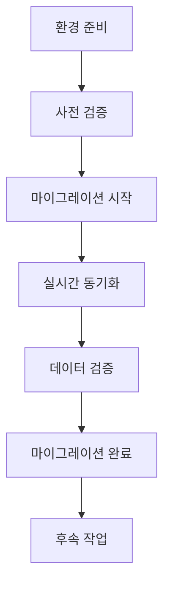

# 마이그레이션 가이드

## 개요

이 가이드는 Redis 7.4.6에서 ElastiCache for Valkey 8.2으로의 온라인 마이그레이션 과정을 단계별로 설명합니다. AWS ElastiCache의 온라인 마이그레이션 기능을 사용하여 다운타임 없이 안전하게 데이터를 마이그레이션할 수 있습니다.

## 마이그레이션 프로세스 개요



## 1단계: 환경 준비

### 1.1 인프라 배포 확인

```bash
# CDK 스택 상태 확인
npx cdk diff

# 스택이 배포되지 않은 경우
npx cdk deploy

# 출력값 확인
aws cloudformation describe-stacks \
    --stack-name ValkeyMigrationStack \
    --query 'Stacks[0].Outputs'
```

### 1.2 환경 변수 설정

배포 완료 후 출력값을 환경 변수로 설정:

```bash
# CloudFormation 출력에서 값 추출
export REDIS_INSTANCE_ID=$(aws cloudformation describe-stacks \
    --stack-name ValkeyMigrationStack \
    --query 'Stacks[0].Outputs[?OutputKey==`RedisInstanceId`].OutputValue' \
    --output text)

export REDIS_PRIVATE_IP=$(aws cloudformation describe-stacks \
    --stack-name ValkeyMigrationStack \
    --query 'Stacks[0].Outputs[?OutputKey==`RedisPrivateIp`].OutputValue' \
    --output text)

export VALKEY_ENDPOINT=$(aws cloudformation describe-stacks \
    --stack-name ValkeyMigrationStack \
    --query 'Stacks[0].Outputs[?OutputKey==`ValkeyPrimaryEndpoint`].OutputValue' \
    --output text)

export VALKEY_REPLICATION_GROUP_ID=$(aws cloudformation describe-stacks \
    --stack-name ValkeyMigrationStack \
    --query 'Stacks[0].Outputs[?OutputKey==`ValkeyReplicationGroupId`].OutputValue' \
    --output text)

# 환경 변수 확인
echo "Redis Instance ID: $REDIS_INSTANCE_ID"
echo "Redis Private IP: $REDIS_PRIVATE_IP"
echo "Valkey Endpoint: $VALKEY_ENDPOINT"
echo "Valkey Replication Group ID: $VALKEY_REPLICATION_GROUP_ID"
```

### 1.3 필요한 도구 설치

```bash
# Redis CLI 설치 (로컬 머신에서)
# macOS
brew install redis

# Ubuntu/Debian
sudo apt-get install redis-tools

# Amazon Linux 2
sudo yum install redis

# AWS CLI 최신 버전 확인
aws --version
# 필요시 업데이트: pip install --upgrade awscli
```

## 2단계: 사전 검증

### 2.1 Redis 서버 상태 확인

```bash
# EC2 Instance Connect를 통한 접속
aws ec2-instance-connect send-ssh-public-key \
    --instance-id $REDIS_INSTANCE_ID \
    --availability-zone $(aws ec2 describe-instances \
        --instance-ids $REDIS_INSTANCE_ID \
        --query 'Reservations[0].Instances[0].Placement.AvailabilityZone' \
        --output text) \
    --instance-os-user ec2-user \
    --ssh-public-key file://~/.ssh/id_rsa.pub

# SSH 접속
ssh ec2-user@$REDIS_PRIVATE_IP
```

Redis 인스턴스에 접속한 후:

```bash
# Redis 서버 상태 확인
redis-cli ping
# 예상 응답: PONG

# Redis 버전 확인
redis-cli info server | grep redis_version
# 예상 응답: redis_version:7.4.6

# Redis 구성 확인
redis-cli config get bind
# 예상 응답: 1) "bind" 2) "0.0.0.0"

redis-cli config get protected-mode
# 예상 응답: 1) "protected-mode" 2) "no"

# 메모리 사용량 확인
redis-cli info memory | grep used_memory_human
```

### 2.2 ElastiCache 클러스터 상태 확인

```bash
# 클러스터 상태 확인
aws elasticache describe-replication-groups \
    --replication-group-id $VALKEY_REPLICATION_GROUP_ID \
    --query 'ReplicationGroups[0].Status'
# 예상 응답: "available"

# 노드 상태 확인
aws elasticache describe-replication-groups \
    --replication-group-id $VALKEY_REPLICATION_GROUP_ID \
    --query 'ReplicationGroups[0].MemberClusters'

# 엔드포인트 연결 테스트 (로컬에서)
redis-cli -h $VALKEY_ENDPOINT -p 6379 ping
# 예상 응답: PONG
```

### 2.3 네트워크 연결성 테스트

Redis 인스턴스에서 ElastiCache로의 연결 테스트:

```bash
# Redis 인스턴스에서 실행
redis-cli -h $VALKEY_ENDPOINT -p 6379 ping
# 예상 응답: PONG

# 네트워크 지연시간 측정
ping -c 5 $VALKEY_ENDPOINT
```

### 2.4 테스트 데이터 준비

```bash
# Redis에 테스트 데이터 추가
redis-cli set migration:test:string "Hello Valkey Migration"
redis-cli hset migration:test:hash field1 "value1" field2 "value2"
redis-cli lpush migration:test:list "item1" "item2" "item3"
redis-cli sadd migration:test:set "member1" "member2" "member3"
redis-cli zadd migration:test:zset 1 "first" 2 "second" 3 "third"

# 데이터 확인
redis-cli keys "migration:test:*"
redis-cli dbsize
```

## 3단계: 마이그레이션 시작

### 3.1 마이그레이션 전 체크리스트

- [ ] Redis 서버가 정상 실행 중
- [ ] ElastiCache 클러스터가 `available` 상태
- [ ] 네트워크 연결성 확인 완료
- [ ] 테스트 데이터 준비 완료
- [ ] 백업 생성 (선택사항)

### 3.2 백업 생성 (권장)

```bash
# Redis 백업 생성
redis-cli bgsave
# 백업 완료 확인
redis-cli lastsave

# ElastiCache 스냅샷 생성
aws elasticache create-snapshot \
    --replication-group-id $VALKEY_REPLICATION_GROUP_ID \
    --snapshot-name "pre-migration-backup-$(date +%Y%m%d-%H%M%S)"
```

### 3.3 온라인 마이그레이션 시작

```bash
# 마이그레이션 시작
aws elasticache start-migration \
    --replication-group-id $VALKEY_REPLICATION_GROUP_ID \
    --customer-node-endpoint-list "Address='$REDIS_PRIVATE_IP',Port=6379"

# 명령 실행 결과 확인
echo "마이그레이션 시작 명령이 실행되었습니다."
echo "Replication Group ID: $VALKEY_REPLICATION_GROUP_ID"
echo "Source Redis: $REDIS_PRIVATE_IP:6379"
```

### 3.4 마이그레이션 상태 모니터링

```bash
# 마이그레이션 상태 확인 스크립트
cat > check_migration_status.sh << 'EOF'
#!/bin/bash

REPLICATION_GROUP_ID=$1

if [ -z "$REPLICATION_GROUP_ID" ]; then
    echo "사용법: $0 <replication-group-id>"
    exit 1
fi

echo "마이그레이션 상태 확인 중..."
echo "================================"

# 전체 상태 확인
STATUS=$(aws elasticache describe-replication-groups \
    --replication-group-id $REPLICATION_GROUP_ID \
    --query 'ReplicationGroups[0].Status' \
    --output text)

echo "클러스터 상태: $STATUS"

# 글로벌 복제 그룹 정보 확인
GLOBAL_INFO=$(aws elasticache describe-replication-groups \
    --replication-group-id $REPLICATION_GROUP_ID \
    --query 'ReplicationGroups[0].GlobalReplicationGroupInfo' \
    --output json)

if [ "$GLOBAL_INFO" != "null" ]; then
    echo "글로벌 복제 그룹 정보:"
    echo $GLOBAL_INFO | jq .
else
    echo "글로벌 복제 그룹 정보: 없음"
fi

# 노드별 상태 확인
echo ""
echo "노드 상태:"
aws elasticache describe-cache-clusters \
    --show-cache-node-info \
    --query "CacheClusters[?ReplicationGroupId=='$REPLICATION_GROUP_ID'].{ClusterId:CacheClusterId,Status:CacheClusterStatus,Role:ReplicationGroupRole}" \
    --output table

EOF

chmod +x check_migration_status.sh

# 상태 확인 실행
./check_migration_status.sh $VALKEY_REPLICATION_GROUP_ID
```

## 4단계: 실시간 동기화 모니터링

### 4.1 동기화 상태 확인

```bash
# 주기적 상태 확인 (5분마다)
watch -n 300 "./check_migration_status.sh $VALKEY_REPLICATION_GROUP_ID"
```

### 4.2 데이터 동기화 테스트

새 터미널에서 실시간 동기화 테스트:

```bash
# Redis에 새 데이터 추가
TIMESTAMP=$(date +%s)
redis-cli -h $REDIS_PRIVATE_IP set "realtime:test:$TIMESTAMP" "migration-test-$TIMESTAMP"

# ElastiCache에서 데이터 확인 (몇 초 후)
sleep 5
redis-cli -h $VALKEY_ENDPOINT get "realtime:test:$TIMESTAMP"
```

### 4.3 성능 모니터링

```bash
# Redis 성능 지표 확인
redis-cli -h $REDIS_PRIVATE_IP info replication

# ElastiCache 메트릭 확인
aws cloudwatch get-metric-statistics \
    --namespace AWS/ElastiCache \
    --metric-name ReplicationLag \
    --dimensions Name=CacheClusterId,Value=$VALKEY_REPLICATION_GROUP_ID-001 \
    --start-time $(date -u -d '1 hour ago' +%Y-%m-%dT%H:%M:%S) \
    --end-time $(date -u +%Y-%m-%dT%H:%M:%S) \
    --period 300 \
    --statistics Average
```

## 5단계: 데이터 검증

### 5.1 전체 데이터 비교

```bash
# 데이터 검증 스크립트 생성
cat > verify_migration_data.sh << 'EOF'
#!/bin/bash

REDIS_HOST=$1
VALKEY_HOST=$2

if [ -z "$REDIS_HOST" ] || [ -z "$VALKEY_HOST" ]; then
    echo "사용법: $0 <redis-host> <valkey-host>"
    exit 1
fi

echo "데이터 검증 시작..."
echo "Redis 소스: $REDIS_HOST"
echo "Valkey 대상: $VALKEY_HOST"
echo "=========================="

# 키 개수 비교
REDIS_KEYS=$(redis-cli -h $REDIS_HOST dbsize)
VALKEY_KEYS=$(redis-cli -h $VALKEY_HOST dbsize)

echo "Redis 키 개수: $REDIS_KEYS"
echo "Valkey 키 개수: $VALKEY_KEYS"

if [ "$REDIS_KEYS" -eq "$VALKEY_KEYS" ]; then
    echo "✓ 키 개수 일치"
else
    echo "✗ 키 개수 불일치"
fi

# 샘플 데이터 검증
echo ""
echo "샘플 데이터 검증:"

# 문자열 타입
REDIS_VAL=$(redis-cli -h $REDIS_HOST get migration:test:string)
VALKEY_VAL=$(redis-cli -h $VALKEY_HOST get migration:test:string)
if [ "$REDIS_VAL" = "$VALKEY_VAL" ]; then
    echo "✓ 문자열 데이터 일치"
else
    echo "✗ 문자열 데이터 불일치: Redis='$REDIS_VAL', Valkey='$VALKEY_VAL'"
fi

# 해시 타입
REDIS_HASH=$(redis-cli -h $REDIS_HOST hgetall migration:test:hash | sort)
VALKEY_HASH=$(redis-cli -h $VALKEY_HOST hgetall migration:test:hash | sort)
if [ "$REDIS_HASH" = "$VALKEY_HASH" ]; then
    echo "✓ 해시 데이터 일치"
else
    echo "✗ 해시 데이터 불일치"
fi

# 리스트 타입
REDIS_LIST=$(redis-cli -h $REDIS_HOST lrange migration:test:list 0 -1)
VALKEY_LIST=$(redis-cli -h $VALKEY_HOST lrange migration:test:list 0 -1)
if [ "$REDIS_LIST" = "$VALKEY_LIST" ]; then
    echo "✓ 리스트 데이터 일치"
else
    echo "✗ 리스트 데이터 불일치"
fi

echo ""
echo "데이터 검증 완료"

EOF

chmod +x verify_migration_data.sh

# 데이터 검증 실행
./verify_migration_data.sh $REDIS_PRIVATE_IP $VALKEY_ENDPOINT
```

### 5.2 메모리 사용량 비교

```bash
# Redis 메모리 사용량
echo "Redis 메모리 사용량:"
redis-cli -h $REDIS_PRIVATE_IP info memory | grep used_memory_human

# ElastiCache 메모리 사용량
echo "ElastiCache 메모리 사용량:"
redis-cli -h $VALKEY_ENDPOINT info memory | grep used_memory_human
```

## 6단계: 마이그레이션 완료

### 6.1 최종 검증

마이그레이션을 완료하기 전 최종 검증:

```bash
# 1. 동기화 상태 확인
./check_migration_status.sh $VALKEY_REPLICATION_GROUP_ID

# 2. 데이터 일치성 확인
./verify_migration_data.sh $REDIS_PRIVATE_IP $VALKEY_ENDPOINT

# 3. 실시간 동기화 테스트
FINAL_TEST_KEY="final:test:$(date +%s)"
redis-cli -h $REDIS_PRIVATE_IP set $FINAL_TEST_KEY "final-test-value"
sleep 5
FINAL_TEST_RESULT=$(redis-cli -h $VALKEY_ENDPOINT get $FINAL_TEST_KEY)

if [ "$FINAL_TEST_RESULT" = "final-test-value" ]; then
    echo "✓ 최종 동기화 테스트 성공"
else
    echo "✗ 최종 동기화 테스트 실패"
    exit 1
fi
```

### 6.2 마이그레이션 완료 실행

```bash
# 마이그레이션 완료
echo "마이그레이션을 완료합니다..."
aws elasticache complete-migration \
    --replication-group-id $VALKEY_REPLICATION_GROUP_ID

echo "마이그레이션 완료 명령이 실행되었습니다."
echo "상태 변경을 확인하세요."
```

### 6.3 완료 후 상태 확인

```bash
# 완료 후 상태 모니터링
echo "마이그레이션 완료 후 상태 확인 중..."
for i in {1..10}; do
    echo "확인 $i/10..."
    ./check_migration_status.sh $VALKEY_REPLICATION_GROUP_ID
    sleep 30
done
```

## 7단계: 후속 작업

### 7.1 애플리케이션 연결 변경

```bash
# 새로운 연결 문자열 정보
echo "새로운 ElastiCache 연결 정보:"
echo "호스트: $VALKEY_ENDPOINT"
echo "포트: 6379"
echo "엔진: Valkey 8.2"
```

### 7.2 성능 테스트

```bash
# 기본 성능 테스트
redis-benchmark -h $VALKEY_ENDPOINT -p 6379 -n 10000 -c 50 -t set,get

# 지연시간 테스트
redis-cli -h $VALKEY_ENDPOINT --latency-history -i 1
```

### 7.3 모니터링 설정

```bash
# CloudWatch 대시보드 생성을 위한 메트릭 확인
aws cloudwatch list-metrics \
    --namespace AWS/ElastiCache \
    --dimensions Name=CacheClusterId,Value=$VALKEY_REPLICATION_GROUP_ID-001
```

### 7.4 정리 작업

```bash
# Redis 인스턴스 정리 (선택사항)
echo "Redis 인스턴스를 정리하시겠습니까? (y/N)"
read -r response
if [[ "$response" =~ ^[Yy]$ ]]; then
    # 인스턴스 종료는 CDK destroy로 수행
    echo "CDK 스택 전체를 삭제하려면 'npx cdk destroy'를 실행하세요."
fi
```

## 문제 해결

### 일반적인 문제와 해결 방법

#### 1. 마이그레이션 시작 실패

**증상**: `start-migration` 명령이 실패
**원인**: 
- Redis 서버가 실행되지 않음
- 네트워크 연결 문제
- 보안 그룹 설정 오류

**해결 방법**:
```bash
# Redis 서버 상태 확인
redis-cli -h $REDIS_PRIVATE_IP ping

# 보안 그룹 규칙 확인
aws ec2 describe-security-groups \
    --group-ids $(aws ec2 describe-instances \
        --instance-ids $REDIS_INSTANCE_ID \
        --query 'Reservations[0].Instances[0].SecurityGroups[0].GroupId' \
        --output text)
```

#### 2. 데이터 동기화 지연

**증상**: ElastiCache에 데이터가 늦게 반영됨
**원인**: 
- 네트워크 지연
- Redis 메모리 부족
- 대용량 데이터 처리

**해결 방법**:
```bash
# 복제 지연 확인
redis-cli -h $REDIS_PRIVATE_IP info replication

# 메모리 사용량 확인
redis-cli -h $REDIS_PRIVATE_IP info memory
```

#### 3. 마이그레이션 완료 실패

**증상**: `complete-migration` 명령이 실패
**원인**: 
- 동기화가 완료되지 않음
- 클러스터 상태 불안정

**해결 방법**:
```bash
# 클러스터 상태 재확인
aws elasticache describe-replication-groups \
    --replication-group-id $VALKEY_REPLICATION_GROUP_ID

# 잠시 대기 후 재시도
sleep 60
aws elasticache complete-migration \
    --replication-group-id $VALKEY_REPLICATION_GROUP_ID
```

### 로그 확인

```bash
# Redis 로그 확인
sudo tail -f /var/log/redis.log

# ElastiCache 로그 (CloudWatch)
aws logs describe-log-groups --log-group-name-prefix "/aws/elasticache"

# 시스템 로그
sudo journalctl -u redis -f
```

### 롤백 절차

마이그레이션 중 문제가 발생한 경우:

```bash
# 1. 마이그레이션 중단 (가능한 경우)
aws elasticache complete-migration \
    --replication-group-id $VALKEY_REPLICATION_GROUP_ID \
    --force

# 2. 백업에서 복원
aws elasticache create-replication-group \
    --replication-group-id $VALKEY_REPLICATION_GROUP_ID-rollback \
    --snapshot-name pre-migration-backup-YYYYMMDD-HHMMSS

# 3. 애플리케이션을 원래 Redis로 되돌림
echo "애플리케이션 연결을 $REDIS_PRIVATE_IP:6379로 되돌리세요."
```

## 성능 최적화 팁

### 마이그레이션 성능 향상

1. **Redis 구성 최적화**:
```bash
# Redis 구성 조정
redis-cli config set save ""  # 백그라운드 저장 비활성화
redis-cli config set stop-writes-on-bgsave-error no
```

2. **네트워크 최적화**:
- 동일 가용 영역 배치
- 인스턴스 타입 업그레이드 고려

3. **모니터링 강화**:
```bash
# 실시간 모니터링 스크립트
watch -n 10 'redis-cli -h $REDIS_PRIVATE_IP info replication | grep master_repl_offset'
```

## 참고 자료

- [AWS ElastiCache 온라인 마이그레이션 공식 문서](https://docs.aws.amazon.com/AmazonElastiCache/latest/dg/OnlineMigration.html)
- [ElastiCache for Valkey 사용자 가이드](https://docs.aws.amazon.com/AmazonElastiCache/latest/dg/valkey.html)
- [Redis 복제 구성 가이드](https://redis.io/topics/replication)
- [AWS CLI ElastiCache 명령 참조](https://docs.aws.amazon.com/cli/latest/reference/elasticache/)